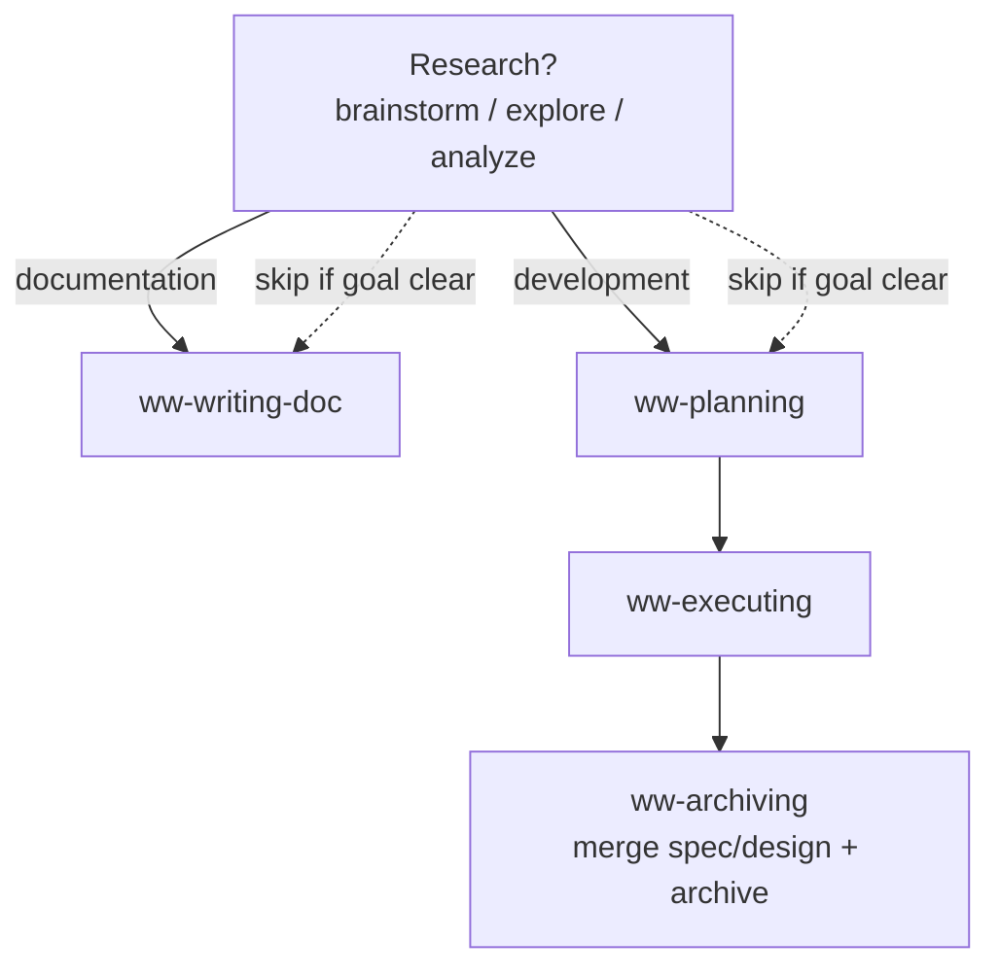

# Wishing Well

Wishing Well is a set of agentic coding extensions for OpenCode, including agents, skills, commands, scripts and more.

## Overview

Wishing Well adapts to the work at hand. Two paths, each with an optional research front:

1. **Documentation** — `(research?)` → `write-doc`: optionally research first (brainstorm / explore / analyze), then write docs directly.
2. **Development** — `(research?)` → `plan` → `execute` → `archive`: optionally research first, then plan, execute, archive. Carry `spec.md` / `design.md` in the Plan; merge them into canonical docs at archive.

### Principles

- **Docs are the SSOT** Specs and design read as the current state.
- **Flexibility** Skills are independently invocable.

## Skills

Several skills define the workflow. Each lives in `skills/<name>/SKILL.md`.

| Skill | Description | Artifact |
| --- | --- | --- |
| `ww-brainstorming` | Divergent research — surface alternatives and converge on a decision. | conclusion (no file) |
| `ww-exploring` | Convergent research — refine a rough idea into a scoped conclusion. | conclusion (no file) |
| `ww-analyzing` | Diagnostic research — locate root cause and define the fix area. | conclusion (no file) |
| `ww-planning` | Write an executable Plan with scope, tasks, and doc-change targets. | `docs/plans/active/YYYY-MM-DD-<slug>/` |
| `ww-executing` | Execute a Plan's tasks — verify and commit each, then hand off to archiving. | code + `plan.md` amendments |
| `ww-writing-doc` | Write or update final-state docs (constitution, glossary, architecture, conventions, contracts, experience, specs, design, ADRs) directly. | `docs/` (constitution/glossary/architecture/conventions/contracts/experience/specs/design/adr) |
| `ww-archiving` | Merge a Plan's spec/design into canonical docs, archive the Plan, and final-commit. | merged docs + `docs/plans/completed/` |

## Commands

Eight thin TUI commands invoke the skills; `/ww-init` bootstraps the doc foundation.

| Command | Loads skill |
| --- | --- |
| `/ww-init` | — (bootstrap, no skill) |
| `/ww-brainstorm` | `ww-brainstorming` |
| `/ww-analyze` | `ww-analyzing` |
| `/ww-explore` | `ww-exploring` |
| `/ww-plan` | `ww-planning` |
| `/ww-execute` | `ww-executing` |
| `/ww-write-doc` | `ww-writing-doc` |
| `/ww-archive` | `ww-archiving` |

## Routing

## Usage

1. Copy `skills/` `commands/` to `~/.config/opencode/` or project's `.opencode/`.
2. Restart OpenCode, then run `/ww-init` to bootstrap the doc foundation, followed by `/ww-explore`, `/ww-plan`, `/ww-execute`, `/ww-write-doc`, or `/ww-archive` as the work requires.

## References

- [`docs/references/`](docs/references) — OpenCode agents, commands, and skills docs.
- [Harness Engineering](https://openai.com/index/harness-engineering/) — the harness engineering methodology.

## License

MIT — see [LICENSE](LICENSE).
