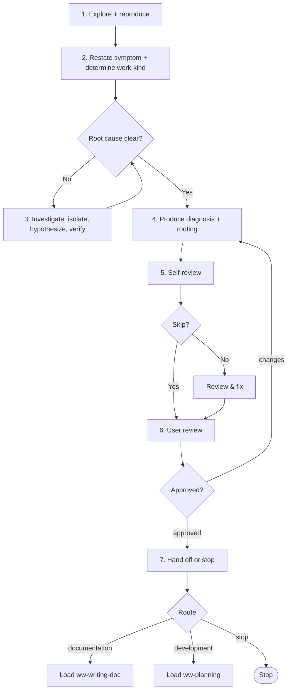

# Analyzing

Diagnose a defect or performance issue — reproduce, locate root cause, define the fix area — and produce a diagnosis conclusion. Diagnosis is not the fix; the fix is planned and executed downstream. No file artifact.

## When to use me

- **Use when** the symptom is known but the cause isn't — bug fixes (reproduce, root-cause, define fix area) or performance analysis/optimization (locate bottleneck, define optimization target).
- **MUST NOT use** to: brainstorm a direction → `ww-brainstorming`; converge a rough idea → `ww-exploring`; write a Plan → `ww-planning`; write docs directly → `ww-writing-doc`.
- **Skip when** the diagnosis is already clear.

## Workflow

Follow these steps in order.

### 1. Explore and reproduce

Read in order, reproduce the symptom, then build a picture of the affected area:

1. `AGENTS.md` — foregrounds `docs/constitution.md`, points to `docs/README.md`.
2. `docs/README.md` — the doc index.
3. Relevant docs and code — `constitution.md`, `architecture.md`, `conventions.md`, `glossary.md`, `specs/`, `design/`, `contracts/`, `adr/`; `references/` as context.
4. Reproduce the symptom (or characterize the performance issue with measurements).

### 2. Restate symptom and determine work-kind

Restate the symptom to the user. Determine the work kind for routing (research kind is fixed — analyzing; only the work-kind is open):

- **development** (default) — the fix will be implemented.
- **documentation** — root cause reveals a spec/design gap that SHOULD be captured as an ADR (e.g. a performance budget).

### 3. Investigate

Isolate variables, form hypotheses, verify against evidence. Use the `question` tool ONE question at a time when user input is needed to narrow the search.

### 4. Produce diagnosis and routing

Produce the diagnosis: root cause + fix area (the scope the fix will touch), plus intended doc changes if any (e.g. an ADR capturing the finding). Route:

- **development** → `ww-planning` (usually no doc changes; carry them only if a decision MUST be recorded).
- **documentation** → `ww-writing-doc` (when the root cause is a spec/design gap warranting a doc decision).

### 5. Self-review

Ask via `question` whether to skip self-review (`yes` / `no`). If `no`, check against the [Self-review checklist](#self-review-checklist), fix in place, then summarize.

### 6. User review — HARD-GATE

Present the diagnosis and routing for user review. You MUST NOT proceed until the user explicitly approves. On requested changes, update and re-present. Loop until approval.

### 7. Hand off or stop

On approval, hand off to the routed skill (`ww-writing-doc` or `ww-planning`) via `question`, or stop.

## Conclusion

The conclusion carries the diagnosis into the next skill. It lives in the conversation (no file); the next skill consumes it and persists what it needs.

### No source of truth here

Analyzing produces no artifact and touches no truth:

- Spec/design remain the source of truth.
- Plan (once written) becomes the source of truth during development execution.
- Docs remain truth for documentation.

## Self-review checklist

- [ ] Symptom reproduced or performance issue characterized with evidence.
- [ ] Root cause identified and verified (not a guess).
- [ ] Fix area / scope defined.
- [ ] Work kind (documentation / development) correctly identified; doc changes carried only if a decision warrants recording.
- [ ] Open questions resolved or explicitly flagged.

## Hard constraints

- MUST touch no file. Analyzing produces no artifact; the conclusion lives in the conversation.
- Diagnosis is not the fix — MUST NOT start coding; the fix belongs to `ww-planning` / `ww-executing`.
- MUST NOT skip the HARD-GATE. User review of the diagnosis and routing is mandatory.
