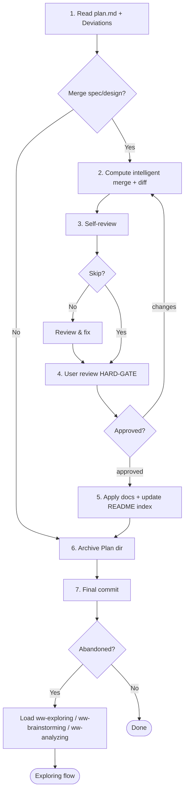

# Archiving

Merge a Plan's `spec.md` / `design.md` into final-state canonical docs — diff-reviewed by the user — then archive the Plan directory and final-commit. Closes out development work and consolidates truth into the updated docs.

## When to use me

- **Use when** closing out a development Plan after `ww-executing`:
  - Normal — merge its `spec.md` / `design.md` (if any) into canonical docs, archive the Plan, final-commit.
  - Bug-fix with no `spec.md` / `design.md` — skip the merge; just archive + commit.
  - Abandoned Plan (fundamental scope error from `ww-executing`) — archive (no merge — the scope was wrong; the Deviations record why) and final-commit, then hand off to `ww-exploring` (general catch-all) or a more specific research skill (`ww-brainstorming` / `ww-analyzing`).
- **MUST NOT use** for: documentation work → `ww-writing-doc`; work with no Plan.

## Workflow

Follow these steps in order.

> **Plans that skip the merge (abandoned, or bug-fix with no `spec.md` / `design.md`):** self-review (step 3) and the user-review HARD-GATE (step 4) are skipped — the self-review checklist is entirely merge-focused, so it is N/A here. The final-commit confirmation (step 7) is the gate. This is the one place the "explicit skip answer" pattern does not apply, because there is nothing to review or apply.

### 1. Read plan.md and deviations

Read `plan.md` (`## Doc-change targets` + `## Deviations`) and decide whether to merge:

- **Doc-change targets** — which of `spec.md` / `design.md` exist and their canonical merge targets.
- **Deviations** — what actually happened vs. the Plan; the merge MUST be reconciled with them so applied docs reflect reality, not stale intentions.
- **Abandoned Plan** (scope-error close-out) or `spec.md` / `design.md` absent → go straight to step 6 (no merge).

### 2. Compute the intelligent merge and diff

For each declared target (`spec.md` → its canonical doc, `design.md` → its canonical doc, which may be `architecture.md` or a `docs/design/` file): re-read the current target doc at archive time. Compute the intelligent merge:

- If the target is a **new file** (greenfield or new topic): the `spec.md` / `design.md` content becomes the new file.
- If the target **exists**: section-level merge — match headings, add/replace sections so the result reads as final-state (no change markers).

Generate a unified diff of the result against the current docs. If a section can't be reconciled (conflicting content, or anchor drift from a mid-flight trivial direct edit), STOP and ask the user to reconcile.

### 3. Self-review

Ask via `question` whether to skip self-review (`yes` / `no`). If `no`: check against the [Self-review checklist](#self-review-checklist); fix the *merge/diff computation* in place (recompute it); summarize.

- `spec.md` / `design.md` are read-only input here.
- If they are wrong, STOP and ask the user (or return to `ww-executing` to amend them).
- MUST NOT edit the Plan here.

### 4. User review — HARD-GATE

Present the unified diff for user review. You MUST NOT apply until the user explicitly approves. On requested changes, adjust and re-present. Loop until approval.

### 5. Apply

On approval, apply the merge:

- Write the updated docs (and any new files).
- Update `docs/README.md`'s index to mirror any newly added doc files.
- ADR lifecycle is handled by `ww-writing-doc`; archiving MUST NOT touch `docs/adr/`.

### 6. Archive the Plan

Move the Plan directory from `docs/plans/active/` to `docs/plans/completed/` (use `git mv` to preserve history; create `completed/` if absent).

### 7. Final commit

Before committing, verify:

- Merge applied correctly (if any).
- `docs/README.md` index updated for new files.
- Plan directory moved via `git mv`.

Then stage the doc changes (if any) and the Plan move, propose a message, confirm with the user via `question`, then commit. MUST NOT commit without explicit approval.

After committing:

- Abandoned Plan (scope-error close-out) → load `ww-exploring` (general catch-all) or a more specific research skill (`ww-brainstorming` / `ww-analyzing`) to re-align.
- Otherwise → done.

## Archiving

Archiving consolidates truth: during execution the Plan was the source of truth and docs lagged; archiving merges `spec.md` / `design.md` so the docs become the live truth again, and files the Plan directory as the change-process record.

### Source of truth

After archiving:

- Updated docs are the source of truth.
- Archived Plan directory (under `docs/plans/completed/`) records the change process — scope, tasks, deviations, doc-change targets. Reconstruct "what changed when" by reading it.

### Intelligent merge

`spec.md` / `design.md` are free-form final-state markdown written by `ww-planning` (possibly amended by `ww-executing`). `ww-archiving` merges them into the canonical docs declared in `plan.md`'s `## Doc-change targets`:

- **New file** — for a new topic.
- **Section-level merge** — into an existing file: match headings, add/replace sections; result reads as final-state.
- The user reviews the unified diff before application.
- On an unresolvable section conflict, STOP and ask the user.

### ADR lifecycle

- ADRs are created and superseded only by `ww-writing-doc`.
- `ww-archiving` MUST NOT touch `docs/adr/`.
- A decision revealed during execution that SHOULD be recorded as an ADR belongs to a separate `ww-writing-doc` invocation.

## Self-review checklist

- [ ] Diff computed correctly against current docs; result reads as final-state (no change markers).
- [ ] Merge targets match `plan.md`'s `## Doc-change targets` declaration.
- [ ] Drift conflicts (unresolvable sections) surfaced and reconciled with the user, not silently.
- [ ] Applied docs will remain project-pure (no agent / skill / workflow / Plan / process references introduced).
- [ ] `docs/README.md` index updated for any newly added doc files.

## Hard constraints

- MUST touch only `docs/specs/`, `docs/design/`, `architecture.md`, `docs/README.md` (index), and the Plan directory (`git mv`). MUST NOT touch code. MUST NOT touch `docs/adr/` (`ww-writing-doc`'s responsibility).
- Applied docs are project artifacts — MUST NOT introduce references to the agent, skills, workflow, Plans, or process into them.
- MUST NOT apply the merge before the diff HARD-GATE.
- MUST NOT commit without explicit approval — confirm the final-commit message.
