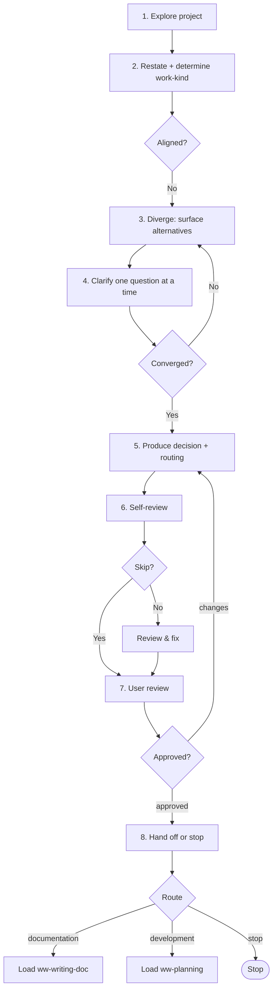

# Brainstorming

Diverge across alternatives, then converge on a decision — helping the user complete key details one question at a time. Produces a decision conclusion (chosen alternative + rationale); no file artifact.

## When to use me

- **Use when** the direction is genuinely undecided and deserves open exploration — e.g. architecture/future decisions, "should we adopt X", "which approach for Y"; the goal is to weigh alternatives and reach a decision.
- **MUST NOT use** to: refine a known idea into scope → `ww-exploring`; diagnose a bug/perf issue → `ww-analyzing`; write a Plan → `ww-planning`; write docs directly → `ww-writing-doc`.
- **Skip when** the decision is already clear.

## Workflow

Follow these steps in order.

### 1. Explore the project

Read in order, then build a picture of how the user's intent fits:

1. `AGENTS.md` — foregrounds `docs/constitution.md`, points to `docs/README.md`.
2. `docs/README.md` — the doc index.
3. Relevant docs and code — `constitution.md`, `architecture.md`, `conventions.md`, `glossary.md`, `specs/`, `design/`, `contracts/`, `adr/`; `references/` as context.

### 2. Restate and determine work-kind

Restate the situation to the user. Determine the work kind for routing (research kind is fixed — brainstorming; only the work-kind is open):

- **documentation** — decision lands as an ADR / global design.
- **development** — the decision will be implemented.

### 3. Diverge — surface alternatives

Offer multiple, genuinely distinct alternatives for the decision at hand. SHOULD NOT anchor on the first option. Make the trade-offs between them visible.

### 4. Clarify one question at a time

Use the `question` tool to help the user complete key details, ONE question at a time — let each answer shape the next.

### 5. Produce decision and routing

Converge on a decision: the chosen alternative + rationale, plus intended doc changes (global design / ADR) if any. Route:

- **documentation** → `ww-writing-doc`.
- **development** → `ww-planning` — ONLY when the conclusion contains a chosen alternative. If still divergent, MUST NOT route to planning; loop back to step 3 or stop.

### 6. Self-review

Ask via `question` whether to skip self-review (`yes` / `no`). If `no`, check against the [Self-review checklist](#self-review-checklist), fix in place, then summarize.

### 7. User review — HARD-GATE

Present the decision and routing for user review. You MUST NOT proceed until the user explicitly approves. On requested changes, update and re-present. Loop until approval.

### 8. Hand off or stop

On approval, hand off to the routed skill (`ww-writing-doc` or `ww-planning`) via `question`, or stop.

## Conclusion

The conclusion carries the decision into the next skill. It lives in the conversation (no file); the next skill consumes it and persists what it needs.

### No source of truth here

Brainstorming produces no artifact and touches no truth:

- Spec/design remain the source of truth.
- Plan (once written) becomes the source of truth during development execution.
- Docs remain truth for documentation.

## Self-review checklist

- [ ] Work kind (documentation / development) correctly identified.
- [ ] Multiple distinct alternatives surfaced; trade-offs visible.
- [ ] Decision states the chosen alternative + rationale.
- [ ] If routing to `ww-planning`, the conclusion contains a chosen alternative (not still divergent).
- [ ] Open questions resolved or explicitly flagged.

## Hard constraints

- MUST touch no file. Brainstorming produces no artifact; the conclusion lives in the conversation.
- MUST NOT route to `ww-planning` with a still-divergent conclusion.
- MUST NOT skip the HARD-GATE. User review of the decision and routing is mandatory.
