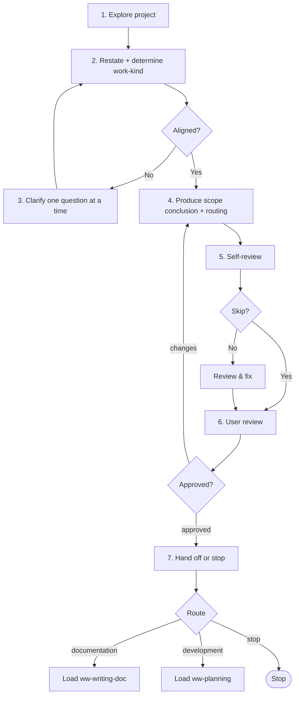

# Exploring

Refine a roughly-formed idea into a scoped conclusion — align on requirements and scope with the user, then route. Produces a scope conclusion; no file artifact.

## When to use me

- **Use when** the user has a rough idea that needs convergence — align scope, resolve ambiguity, decide in/out; the direction is clear enough to converge but the boundaries aren't.
- **MUST NOT use** to: brainstorm divergent alternatives → `ww-brainstorming`; diagnose a bug/perf issue → `ww-analyzing`; write a Plan → `ww-planning`; write docs directly → `ww-writing-doc`.
- **Skip when** the goal/scope is already clear.

## Workflow

Follow these steps in order.

### 1. Explore the project

Read in order, then build a picture of how the user's intent fits:

1. `AGENTS.md` — foregrounds `docs/constitution.md`, points to `docs/README.md`.
2. `docs/README.md` — the doc index.
3. Relevant docs and code — `constitution.md`, `architecture.md`, `conventions.md`, `glossary.md`, `specs/`, `design/`, `contracts/`, `adr/`; `references/` as context.

### 2. Restate and determine work-kind

Restate the situation to the user. Determine the work kind for routing (research kind is fixed — exploring, convergent; only the work-kind is open):

- **documentation** — refinement lands as spec / domain design.
- **development** — the idea will be implemented.

### 3. Clarify one question at a time

Use the `question` tool to resolve ambiguity, ONE question at a time — let each answer shape the next. Stop once you and the user share the same understanding.

### 4. Produce scope conclusion and routing

Produce the conclusion: refined scope (in/out), requirements where useful, plus intended doc changes (specs / domain design) if any. Route:

- **documentation** → `ww-writing-doc`.
- **development** → `ww-planning`.

### 5. Self-review

Ask via `question` whether to skip self-review (`yes` / `no`). If `no`, check against the [Self-review checklist](#self-review-checklist), fix in place, then summarize.

### 6. User review — HARD-GATE

Present the conclusion and routing for user review. You MUST NOT proceed until the user explicitly approves. On requested changes, update and re-present. Loop until approval.

### 7. Hand off or stop

On approval, hand off to the routed skill (`ww-writing-doc` or `ww-planning`) via `question`, or stop.

## Conclusion

The conclusion carries the aligned scope into the next skill. It lives in the conversation (no file); the next skill consumes it and persists what it needs.

### No source of truth here

Exploring produces no artifact and touches no truth:

- Spec/design remain the source of truth.
- Plan (once written) becomes the source of truth during development execution.
- Docs remain truth for documentation.

## Self-review checklist

- [ ] Work kind (documentation / development) correctly identified.
- [ ] Scope clear; in/out boundaries stated.
- [ ] Doc changes (if any) stay at requirements level for specs; tech detail in design.
- [ ] Open questions resolved or explicitly flagged.

## Hard constraints

- MUST touch no file. Exploring produces no artifact; the conclusion lives in the conversation.
- MUST NOT skip the HARD-GATE. User review of the conclusion and routing is mandatory.
