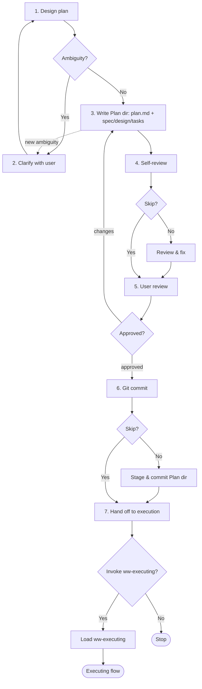

# Planning

Turn a research conclusion (or a clear user goal) into an executable Plan of fine-grained, verifiable tasks, plus any doc changes (carried as `spec.md` / `design.md`) — then hand off to implementation.

## When to use me

- **Use when** writing a Plan for development work (feature or bug fix) — task decomposition, ordering, verification, and doc-change targets. Invoke directly when the goal is clear, or after a research skill (`ww-brainstorming` / `ww-exploring` / `ww-analyzing`).
- **MUST NOT use** for: documentation work → `ww-writing-doc`; research → a research skill; coding → `ww-executing`.

## Workflow



Follow these steps in order.

### 1. Design the plan

Read the inputs, design the approach, restate it to the user. If the goal is clear (no exploring), take scope from the user input.

- **Read** — research conclusion (if any); target specs under `docs/specs/`; design docs under `docs/design/`; `architecture.md`, `conventions.md`, `glossary.md`; ADRs under `docs/adr/`; relevant code/build tooling.
- **Design** — which slice this Plan covers; what changes; which areas; the strategy; what doc changes (`spec.md` / `design.md`) it carries; which canonical docs they merge into at archive.

### 2. Clarify with the user

Use the `question` tool to resolve ambiguity, ONE question at a time. If a spec/design gap or contradiction surfaces, note it as a revision suggestion in the Plan — MUST NOT edit the docs here.

### 3. Write the Plan

Create the Plan directory at its [Storage path](#storage-path) containing only the files this Plan needs. **Only `plan.md` is mandatory; create `spec.md` / `design.md` / `tasks.md` only when they have content, and declare each in `plan.md`.**

- `plan.md` (mandatory) — the manifest. Sections:
  - Traceability header — reference the spec(s), design doc(s), ADR(s) this Plan realizes.
  - `## Scope` — goal, slice, out-of-scope (from a research skill or user).
  - `## Doc-change targets` — for each of `spec.md` / `design.md` / `tasks.md` that exists, declare its disposition at archive. For `spec.md` and `design.md`, state the canonical doc each merges into and whether it is a new file or a section merge into an existing file (e.g. `spec.md → docs/specs/auth/login.md (section merge)`; `design.md → docs/design/auth/login.md (new file)`; `design.md → architecture.md (section merge)`). `tasks.md` is execution-only (not merged). If a file is absent, state why (e.g. "No spec changes — `spec.md` omitted.").
  - `## Deviations` — empty on creation; appended during execution per `ww-executing`.
- `spec.md` (if this Plan changes specs) — the incremental requirements spec, written as final-state markdown (no change markers). Stays at the requirements level (goals, scope, requirements, constraints, acceptance). Omit for bug fixes that don't change specs.
- `design.md` (if this Plan carries a design; **required for greenfield**) — the technical design, final-state markdown. Architecture/shape, technology selection, internal API & data-model shape, database structure design (e.g. `db-schema`), configuration. (Outward-facing contracts belong in `docs/contracts/`, maintained by `ww-writing-doc` — not carried by the Plan.) Optional for non-greenfield.
- `tasks.md` (if this Plan has dev tasks) — fine-grained, atomic code tasks, each with a verification method. Prefer test-first for behavior-bearing tasks.

Create or modify ONLY files within this Plan directory. If new ambiguity emerges, return to step 2.

### 4. Self-review

Ask via `question` whether to skip self-review (`yes` / `no`). If `no`, check against the [Self-review checklist](#self-review-checklist), fix in place, then summarize.

### 5. User review — HARD-GATE

Present the Plan for user review. You MUST NOT proceed until the user explicitly approves. On requested changes, update and re-present; if changes are substantive, re-run the self-review first. Loop until approval.

### 6. Git commit

Ask via `question` whether to skip the commit (`yes` / `no`). If `no`, stage only the Plan directory, propose a message, confirm files + message with the user, then commit. MUST NOT commit without explicit approval.

### 7. Hand off to implementation

Ask via `question` whether to invoke the `ww-executing` skill next (`yes` / `no`). If `yes`, load it and continue. If `no`, stop.

## Plan

A Plan is the **execution path** for development work — the how. During execution it is the source of truth; after archiving, truth consolidates into the updated docs (per `ww-archiving`).

### Source of truth

During a Plan's lifecycle, the Plan is the source of truth — docs lag and are merged at archive.

- Spec governs requirements; design governs shape; Plan governs execution.
- Plans MUST NOT contradict spec or design. If they would: note a revision suggestion and include the correction as `spec.md` / `design.md` in the Plan (applied at archive).
- If the gap is fundamental, return to `ww-exploring` (general catch-all) or a more specific research skill (`ww-brainstorming` / `ww-analyzing`).
- MUST NOT leave docs stale after archive.

### What a Plan contains

- A directory under `docs/plans/active/YYYY-MM-DD-<slug>/`.
- `plan.md` (mandatory manifest): traceability, `## Scope`, `## Doc-change targets`, `## Deviations` (empty on creation).
- `spec.md` / `design.md` / `tasks.md` as needed, each declared in `plan.md`.
- Fine-grained, atomic tasks (in `tasks.md`), each with a verification method.
- A `## Deviations` section in `plan.md` (empty on creation; appended during execution).

### Plan directory layout

```txt
docs/plans/active/YYYY-MM-DD-<slug>/
├── plan.md       # mandatory: traceability + Scope + Doc-change targets + Deviations
├── spec.md       # if spec changes: incremental requirements spec (final-state)
├── design.md     # if design (required for greenfield): technical design (final-state)
└── tasks.md      # if dev tasks: atomic tasks with verification
```

Only `plan.md` is mandatory. Create `spec.md` / `design.md` / `tasks.md` only when they have content, and declare each in `plan.md`'s `## Doc-change targets`.

### Doc-change targets

Declared in `plan.md`:

- For `spec.md` and `design.md`: state the canonical doc each merges into at archive, and whether it is a new file or a section merge.
- `tasks.md`: execution-only (not merged).
- If a file is omitted, state why.
- `ww-archiving` reads this declaration to drive the intelligent merge.

A Plan may carry doc changes only to `docs/specs/`, `docs/design/`, and `architecture.md`. All other docs (`constitution.md`, `glossary.md`, `conventions.md`, `contracts/`, `experience/`, `adr/`) are maintained by `ww-writing-doc`.

### Spec vs design vs contracts

A spec states *what the system MUST be* — the requirements level. Design states *how it's shaped* (internal). Contracts state the *outward-facing agreements*. Keep them separate:

- **Spec** — goals & scope, non-goals, success criteria, requirements, constraints (security / privacy / reliability / compatibility), scenarios / acceptance checks.
- **Design (not spec)** — architecture & module boundaries, technology selection with rationale, internal API & data-model shape, database structure design (e.g. `db-schema`), configuration.
- **Contracts (not design)** — outward-facing contracts that external consumers depend on: the complete API doc, external event payloads, external data-model schemas.

The Plan carries `spec.md` and `design.md` only:

- Merges into `docs/specs/` / `docs/design/` / `architecture.md` (internal design, incl. `db-schema`).
- Outward-facing contracts (`docs/contracts/`) are maintained by `ww-writing-doc`, not carried by a Plan.
- Implementation detail (classes/functions, file layout, step-by-step) belongs in `tasks.md`, not in any of these.

### Test and verification rules

- Every task MUST be verifiable: define a check that passes when the task is done.
- Prefer automated checks — tests, linters, type checks, build — over manual inspection. Reuse existing repo commands where available.
- If no automated check exists, plan a task to write one, or state an explicit manual verification with the expected observable result.
- Prefer test-first (TDD) for behavior-bearing tasks.
- Order tasks so each is verifiable on completion; note dependencies.

### What stays in the canonical docs (not the Plan)

- The target state lives in canonical docs, not the Plan:
  - **Spec** — requirements, goals, scope, non-goals, acceptance scenarios.
  - **Design** — the system's shape, tech, internal API & data-model design incl. `db-schema`.
  - **Contracts** — outward-facing API/event/data-model contracts.
- The Plan realizes them; outward-facing contracts are maintained by `ww-writing-doc`.

## Storage path

- Place under `docs/plans/active/YYYY-MM-DD-<slug>/` (date prefix for ordering).
- On archive, `ww-archiving` moves it to `docs/plans/completed/` via `git mv`.
- Pick `<slug>` as a short kebab-case slug matching the spec topic where possible.

## Self-review checklist

- [ ] Scope clear; out-of-scope stated.
- [ ] `plan.md` present with traceability + `## Scope` + `## Doc-change targets` + `## Deviations` (empty).
- [ ] `spec.md` / `design.md` / `tasks.md` created only when they have content; each declared in `plan.md`'s `## Doc-change targets`.
- [ ] Doc-change targets state, for `spec.md` and `design.md`, the canonical merge target + new-file vs section-merge.
- [ ] Tasks (in `tasks.md`) are fine-grained and atomic; each has a concrete verification method.
- [ ] Verification prefers automated checks; manual checks state expected results.
- [ ] Tests planned test-first where the task bears behavior.
- [ ] `spec.md` stays at requirements level; tech detail in `design.md`; implementation detail in `tasks.md`.
- [ ] Greenfield areas (no existing spec/design) carry both `spec.md` and `design.md` (targeting new files).
- [ ] Doesn't contradict spec or design; gaps noted as revision suggestions, not silently worked around.
- [ ] Path follows `docs/plans/active/YYYY-MM-DD-<slug>/`.

## Hard constraints

- In this flow, MUST create or modify ONLY files within the Plan directory. MUST touch no other file — no spec/design edits (note revision suggestions instead), no code, no index updates.
- Only `plan.md` is mandatory; `spec.md` / `design.md` / `tasks.md` MUST exist only when they have content, and MUST be declared in `plan.md`.
- A Plan MUST carry doc changes only to `docs/specs/`, `docs/design/`, and `architecture.md`. Other docs are `ww-writing-doc`'s responsibility.
- Greenfield: if the Plan's scope covers an area with no existing spec/design, the Plan MUST carry both `spec.md` and `design.md` — code MUST NOT land for an undocumented area.
- MUST NOT skip a gated step. User review is a HARD-GATE; the self-review, commit, and handoff skips each require an explicit user answer.
- MUST NOT commit without explicit approval.
