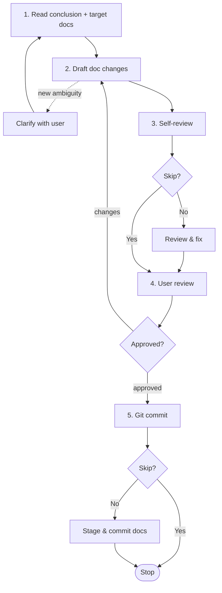

# Writing-doc

Write or update final-state docs directly from a research conclusion — for substantive documentation work. No Plan, no code.

## When to use me

- **Use when** writing/updating substantive documentation not tied to immediate code — project charter, glossary, architecture, conventions, contracts, experience notes, spec/design refinements, ADRs. Invoke after a research skill (`ww-brainstorming` / `ww-exploring` / `ww-analyzing`), or directly when the decision is clear.
- **MUST NOT use** for: development work (doc changes ride as `spec.md` / `design.md` in a Plan, merged by `ww-archiving`); trivial edits (typos, formatting — edit directly, no skill).

## Workflow

Follow these steps in order.

### 1. Read conclusion and target docs

- **Read** the research conclusion (decision/content). If invoked directly (no research skill), take the conclusion from user input.
- **Read** the existing target docs under `docs/` — `constitution.md`, `glossary.md`, `architecture.md`, `conventions.md`, `contracts/`, `experience/`, `specs/`, `design/`, `adr/`.

### 2. Draft doc changes

Draft the changes — merge the conclusion into final-state docs (docs read as current state, no change markers):

- **New ADR** — create `docs/adr/NNN-<slug>.md` (3-digit, zero-padded) with frontmatter (`date`, `status: draft`).
- **Supersede** — set the old ADR's frontmatter to `status: superseded` + `superseded_by`; the new ADR's to `supersedes`.
- **`docs/adr/index.md`** — list only effective (non-superseded) ADRs.
- Add traceability links where relevant.
- Update `docs/README.md`'s index to mirror any doc files added.

### 3. Self-review

Ask via `question` whether to skip self-review (`yes` / `no`). If `no`, check against the [Self-review checklist](#self-review-checklist), fix in place, then summarize.

### 4. User review — HARD-GATE

Present the drafted docs for user review:

- MUST NOT proceed until the user explicitly approves.
- On requested changes: update and re-present; if changes are substantive, re-run the self-review first. Loop until approval.
- On approval: set any new ADR's `status` to `accepted`.

### 5. Git commit

Ask via `question` whether to skip the commit (`yes` / `no`). If `no`, stage only the doc files (including `docs/adr/index.md` and `docs/README.md`), propose a message, confirm files + message with the user, then commit. MUST NOT commit without explicit approval.

## Writing-doc

Writing-doc lands final-state doc truth for documentation work. The docs are the source of truth; there is no Plan, no deferred application.

### Source of truth

Writing-doc updates docs directly — they are immediately the live truth. No in-flight split (unlike development, where docs lag during execution).

- Spec governs requirements; design governs internal shape (incl. data structures); contracts govern outward-facing agreements; charter (`constitution.md`) governs principles.
- Change process is captured in ADRs (decisions) and git history; the docs themselves are final-state (current state, no change history).
- No archived Plan is produced.

### What it contains

- Docs that read as final-state (current requirements/shape/contracts, no change history).
- New or superseded ADRs with valid frontmatter.
- `docs/adr/index.md` listing only effective decisions.
- `docs/README.md` index kept current.
- Traceability links in doc headers where relevant.

### Doc types and their rules

- **`constitution.md`** — project charter: purpose, top-level goals, principles, invariants, hard constraints. (Replaces the old foundation-spec role.)
- **`glossary.md`** — global glossary of terms. **Append-only**: MUST NOT delete existing entries; add new terms or revise definitions in place.
- **`architecture.md`** — global architecture + tech stack (languages, frameworks, libraries, data stores). Module boundaries, component relationships, runtime topology, and technology selection together.
- **`conventions.md`** — naming, layering, error handling, commit/test conventions observed in the code. Split into `conventions/` when large.
- **`contracts/`** — outward-facing contracts that external consumers depend on (language/tech-agnostic). `api.md` is the complete API doc; add `<slug>.md` (e.g. `events.md`) as needed.
- **`experience/`** — lessons learned. `pitfalls.md` for common mistakes; add `<slug>.md` as needed. **Append-only**: MUST NOT delete existing entries; add or revise.
- **`specs/`** — requirements specs (what the system MUST be). `<slug>.md` global; `<domain>/<slug>.md` per domain.
- **`design/`** — system design per domain: modules/boundaries/interactions, internal API & data-model shape, database structure design (e.g. `<domain>/db-schema.md`). `<slug>.md` global; `<domain>/<slug>.md` per domain.
- **`adr/`** — architecture decision records. `NNN-<slug>.md` (3-digit, zero-padded). `index.md` lists only effective (non-superseded) ADRs.

### Spec vs design vs contracts

A spec states *what the system MUST be* — the requirements level. Design states *how it's shaped* (internal). Contracts state the *outward-facing agreements*. Keep them separate:

- **Spec** — goals & scope, non-goals, success criteria, requirements, constraints (security / privacy / reliability / compatibility), scenarios / acceptance checks.
- **Design (not spec)** — architecture & module boundaries, technology selection with rationale, internal API & data-model shape, database structure design (e.g. `db-schema`), configuration.
- **Contracts (not design)** — outward-facing contracts that external consumers depend on (language/tech-agnostic): the complete API doc, external event payloads, external data-model schemas.

Implementation detail (specific classes/functions, file layout, step-by-step) belongs in a Plan's `tasks.md`, not in any of these.

### Granularity rules

- Default: ONE design doc per topic — `docs/design/<domain>/<slug>.md` (or `docs/design/<slug>.md` ungrouped).
- Split a concern out when it is large (>150 lines) and referenced elsewhere, cross-cutting, or has its own change cadence.
- Global docs (`architecture.md`, `conventions.md`) hold cross-cutting concerns.

## Storage path

- Charter / glossary / architecture / conventions: `docs/constitution.md`, `docs/glossary.md`, `docs/architecture.md`, `docs/conventions.md`.
- Contracts: `docs/contracts/api.md`, `docs/contracts/<slug>.md`.
- Experience: `docs/experience/pitfalls.md`, `docs/experience/<slug>.md`.
- Specs: `docs/specs/<slug>.md` (default); `docs/specs/<domain>/<slug>.md` (per domain).
- Design: `docs/design/<slug>.md`; `docs/design/<domain>/<slug>.md` (per domain).
- ADR: `docs/adr/NNN-<slug>.md`; `docs/adr/index.md` lists effective decisions.

Mirror existing layout if present.

## Self-review checklist

- [ ] Docs read as final-state (no change markers / history).
- [ ] ADR frontmatter valid (`date` + `status`); superseded ADRs carry `superseded_by`; new ADRs superseding a prior one carry `supersedes`.
- [ ] `docs/adr/index.md` lists only effective (non-superseded) ADRs with status and link.
- [ ] Traceability links present in doc/ADR headers where relevant.
- [ ] Spec stays at requirements level (no architecture/tech/API/data/config — those are design/contracts); implementation detail deferred to a Plan.
- [ ] Docs contain no agent / skill / workflow / Plan / process references — purely project-focused.
- [ ] `glossary.md` and `experience/` entries are append-only (no deletions; add/revise only).
- [ ] Greenfield areas have both spec and design produced.
- [ ] `docs/README.md` index updated to mirror any doc files added.
- [ ] Paths follow the `docs/` conventions.

## Hard constraints

- In this flow, MUST create or modify ONLY files under `docs/` (`constitution.md`, `glossary.md`, `architecture.md`, `conventions.md`, `contracts/`, `experience/`, `specs/`, `design/`, `adr/` incl. `index.md`) and `docs/README.md` (index). MUST NOT touch code, Plans, or `references/` (user-maintained only).
- Docs are project artifacts, not agent artifacts. They MUST NOT reference the coding agent, skill names, the workflow, Plans, or any process — write them as a human project author would, focused on the project alone.
- `glossary.md` and `experience/` MUST be append-only.
- `references/` is user-maintained — MUST NOT write to it.
- Greenfield: when establishing docs for a new area (no existing spec/design), MUST produce both the spec (requirements) and the design (shape) — MUST NOT leave one absent for a new area.
- MUST NOT skip a gated step. User review is a HARD-GATE; the self-review and commit skips each require an explicit user answer.
- MUST NOT commit without explicit approval.
